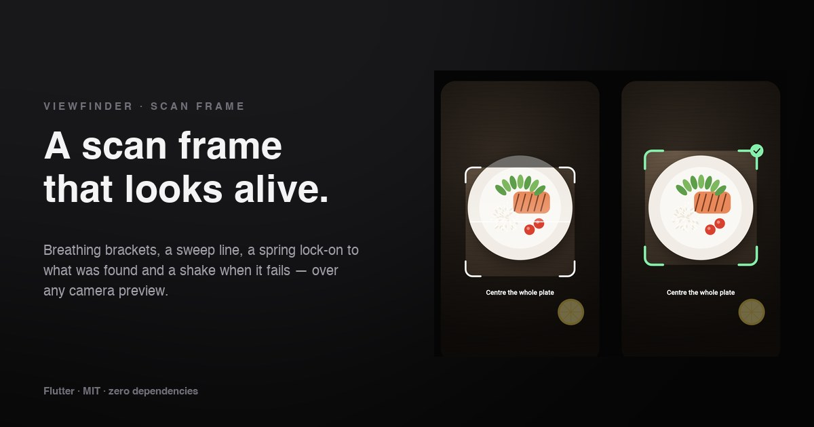

# Viewfinder

A scan-frame overlay for Flutter camera screens. While scanning, the corner
**brackets breathe** and a **line sweeps** the frame. When something is
found, the frame **springs onto it** and a check pops in. When it can't read
anything, the frame **shakes** and turns red.

**[→ Live demo](https://yagnikbarasiya23.github.io/viewfinder_scan_frame/)** (the example app, built for the web — the camera scene is drawn in code)



No dependencies beyond Flutter itself — it wraps whatever preview you already
use (`camera`, `mobile_scanner`, a still image…).

## Why

A static rectangle over a camera preview gives no feedback. People don't know
whether the app is working, whether it saw anything, or why it gave up.
Viewfinder turns the scanner's state into motion people read instantly:
alive while looking, decisive when it finds something, clear when it fails.

## Install

```yaml
dependencies:
  viewfinder_scan_frame:
    git:
      url: https://github.com/YagnikBarasiya23/viewfinder_scan_frame.git
```

Requires Flutter 3.47 or newer.

## Use it

```dart
import 'package:viewfinder_scan_frame/viewfinder_scan_frame.dart';

Viewfinder(
  status: status,                 // idle, searching, locked or failed
  target: detectedBox,            // fractions of the preview, e.g. Rect.fromLTRB(.2, .3, .8, .7)
  hint: 'Centre the whole plate',
  child: CameraPreview(controller),
)
```

Drive `status` from your detection code:

| Status | What you see |
| --- | --- |
| `idle` | A still frame — e.g. while the camera starts |
| `searching` | Brackets breathe in and out; a line with a soft trail sweeps top to bottom |
| `locked` | The frame springs (with a little overshoot) onto `target`, brackets thicken and turn green, a check badge pops in |
| `failed` | One decaying shake and a red frame |

`target` is given as fractions of the child's size, so it works with any
preview resolution: divide your detector's box by the image size.

### Properties

| Property | Default | |
| --- | --- | --- |
| `status` | required | See above |
| `child` | `null` | The preview under the frame |
| `target` | `null` | Detected region (0–1) to lock onto |
| `widthFactor` | `0.72` | Resting frame width as a share of the overlay |
| `aspectRatio` | `1` | Resting frame width / height; it's capped at 62 % of the height |
| `color` | white | Idle and searching colour |
| `lockedColor` | green | Locked colour |
| `failedColor` | red | Failed colour |
| `scrimColor` | 55 % black | Dims outside the frame; transparent turns it off |
| `strokeWidth` | `4` | Bracket thickness |
| `cornerLength`, `cornerRadius` | `34`, `16` | Bracket shape |
| `hint`, `hintStyle` | `null` | Instruction under the frame |
| `semanticLabels` | English defaults | Announcement for each status |

## How it works

- **Four controllers, one painter.** A repeating loop drives the breathing
  and the sweep; a lock controller moves the frame from its resting rect to
  the target (`easeOutBack` for the catch); a shake controller plays once on
  failure; a tint controller cross-fades colours between states. A single
  `CustomPainter` draws everything from those values.
- **Geometry you can test.** `viewfinderRect()` computes the resting frame,
  `denormalize()` turns the fractional target into pixels, `shakeOffset()` is
  a decaying sine, and `cornerPath()` builds all four rounded L-brackets as
  one path, shrinking them for small frames so they never cross.
- **A scrim with a hole.** The dimming layer is one even-odd path: the whole
  overlay minus a rounded rect that follows the frame, including while it
  locks and shakes.
- **Nothing runs when nothing moves.** The loop only repeats while
  searching; in every other state the painter settles and stops.

## Accessibility

- The overlay is a **live region**: when the status changes, screen readers
  announce “Scanning”, “Found” or “Could not read it. Try again.” (all
  replaceable through `semanticLabels`).
- The hint text is excluded from semantics so it isn't read twice.
- With *reduce motion* enabled there is no breathing, sweep or shake, and
  the frame jumps straight to the target.

## Example app

```bash
cd example
flutter run            # any device
flutter run -d chrome  # the web demo
```

The example draws a plate on a wooden table instead of opening the camera,
and has buttons to run a successful scan, a failed scan, or jump straight to
any state.

## Tests

```bash
flutter test
```

Covers the frame, target and shake maths, bracket bounds, the searching loop
and its announcement, locking onto a target, the failure shake, releasing a
lock, and reduced motion.

## Licence

[MIT](LICENSE) © 2026 Yagnik Barasiya. Use it in personal and client work.

More components at [yagnikbarasiya.com/components](https://www.yagnikbarasiya.com/components).
